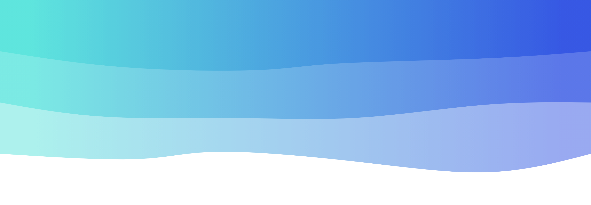

### Hello World, I'm Aaditya  👋  - aka **Crazy Coder**


&nbsp;
&nbsp;
&nbsp;

## I'm a Student, Developer!!🖐️
- ✍ You can find my projects here
- 🌱 I’m currently learning Django and NeoVim
- 👯 I’m looking to collaborate on open source
- 💬 Ask me about Python ...Anything
- 😄 Pronouns: He/Him
- ⚡ Fun fact: I speak 4 languages ( English, Telegu, Hindi, Marathi)


### Talk with me, I am kinda awesome:
Mail me at 👉 &nbsp;&nbsp;`aadityapyarla82@gmail.com`

<hr>

### Current Situation 😁
```I am currently learning Django for making some cool web apps for my own projects 😆 ```

### Languages and Tools:

[][youtube]
&nbsp;
[][youtube]
&nbsp;
&nbsp;
[][youtube]
&nbsp;
&nbsp;
[][youtube]
&nbsp;
&nbsp;
[][youtube]
&nbsp;
&nbsp;
[][youtube]
&nbsp;
&nbsp;
[][youtube]
&nbsp;
&nbsp;
[][youtube]
&nbsp;
&nbsp;
[][youtube]
&nbsp;
&nbsp;
[][youtube]


---

<a href="#" align="right">
<<<<<<< HEAD
  
=======
  
>>>>>>> 30d81e4c181f6a43ab2febaf7f2af2cf92bac158
</a>
&nbsp;
&nbsp;
&nbsp;

<a href="#">
  
</a>

<br />
<br />

<a href="https://github.com/aadityapyarla/HangMan">
  
</a>
&nbsp;
&nbsp;
&nbsp;
<a href="https://github.com/aadityapyarla/SpaceInvaders">
  
</a>
<br />
<br />
<a href="https://github.com/aadityapyarla/dotfiles">
  
</a>
&nbsp;
&nbsp;
&nbsp;
<a href="https://github.com/aadityapyarla/NeoVim">
  
</a>
<br />
<br />
<a href="https://github.com/aadityapyarla/dj-ecommerce">
  
</a>
&nbsp;
&nbsp;
&nbsp;
<a href="https://github.com/aadityapyarla/django-sensive">
  
</a>

<hr>
<p align="center">
  <i>Let's connect and chat! Open to anything under the sun.</i>

  <p align="center">
    <a href="https://twitter.com/APyarla" alt="Twitter"></a>
    <a href="mailto:aadityapyarla82@gmail.com" alt="Contact me"></a>
  </p>
</p>


[youtube]: https://github.com/Aadityapyarla
